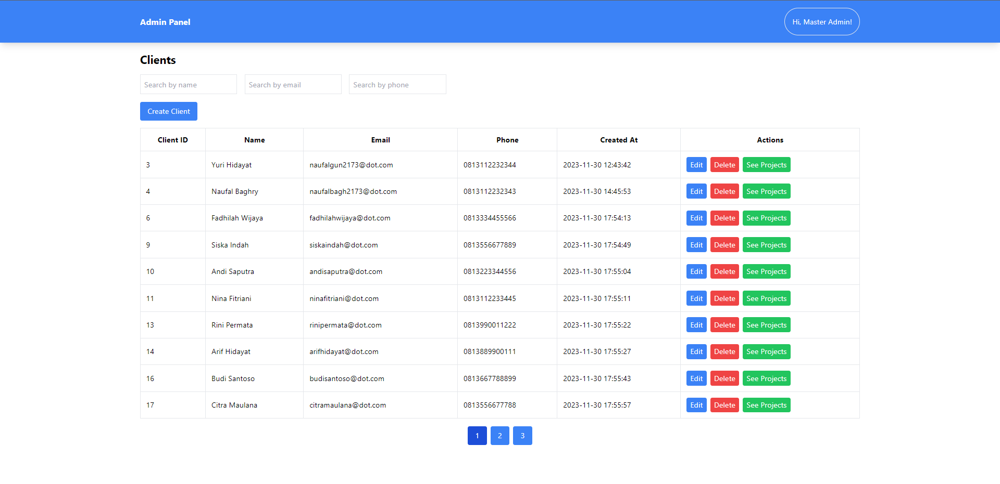

# <h1 align="center"> ✨ Admin Panel - DOT Challenge Backend Engineer (Laravel) ✨ <h4 align="center"> by Gibran Fasha Ghazanfar 💫</h4> </h1>

## About

Project pada repository ini adalah berupa admin panel (CRUD) yang ditujukan untuk penggunaan internal suatu perusahaan penyedia layanan berupa pembuatan solusi digital (berupa Web Application, Mobile Application, IoT Infrastructure (Firmware), dll). Admin panel ini digunakan untuk mengelola data-data seperti client (customer yang menggunakan jasa perusahaan penyedia layanan berbasis solusi digital) dan project (proyek yang dikerjakan oleh perusahaan penyedia layanan berbasis solusi digital), dan user (berupa ADMIN yang dapat mengakses admin panel ini).

## Branching

-   `main` branch adalah branch utama yang digunakan untuk deploy ke production
-   `development` branch adalah branch yang digunakan untuk development

## Commit Message Convention (Semantic)

-   `feat`: (new feature for the user, not a new feature for build script)
-   `fix`: (bug fix for the user, not a fix to a build script)
-   `docs`: (changes to the documentation)
-   `style`: (formatting, missing semi colons, etc; no production code change)
-   `refactor`: (refactoring production code, eg. renaming a variable)
-   `test`: (adding missing tests, refactoring tests; no production code change)
-   `chore`: (updating grunt tasks etc; no production code change)

## How to Run Locally

### Backend

1. Clone repository ini (branch `main`)
2. cd ke root folder
3. Buka folder project di Visual Studio Code (`code .` in CLI)
4. Buka terminal dan run `composer install`
5. Run 'php artisan migrate'
6. Run 'php artisan serve'
7. Buka browser dan akses`localhost:8000`

### Frontend

1. Clone repository ini (branch `main`)
2. cd ke folder `react-fe`
3. Buka folder project di Visual Studio Code (`code .` in CLI)
4. Buka terminal dan run `npm install`
5. Run 'npm run dev'
6.  Buka browser dan akses`localhost:3000`

## Environtment Variables

Sudah disediakan file `.env.example` yang dapat digunakan untuk membuat file `.env` yang berisi environtment variables yang dibutuhkan oleh aplikasi ini. Untuk menjalankan aplikasi ini, pastikan sudah mengisi environtment variables yang dibutuhkan.

## Database Design

### Penjelasan Database Design

-   Terdapat 3 tabel utama, yaitu `users`, `clients`, dan `projects`
-   Tabel `users` digunakan untuk menyimpan data user yang dapat mengakses admin panel ini. User yang dapat mengakses admin panel ini semuanya diasumsikan sebagai ADMIN.
-   Tabel `clients` digunakan untuk menyimpan data client (customer yang menggunakan jasa perusahaan penyedia layanan berbasis solusi digital)
-   Tabel `projects` digunakan untuk menyimpan data project (proyek yang dikerjakan oleh perusahaan penyedia layanan berbasis solusi digital)

- Kardinalitas antar tabel:
    - Tabel `users` sebenarnya adalah tabel yang tidak memiliki kardinalitas dengan tabel lainnya, karena tabel ini hanya digunakan untuk menyimpan data user yang dapat mengakses admin panel ini. Namun, karena user dapat mengakses semua data pada admin panel ini, tabel `users` memiliki kardinalitas 1:N dengan tabel `clients` dan tabel `projects` secara 'tidak langsung' :D. Namun, sebenarnya tidak ada kaitannya sama sekali dalam logika database design (logika bisnisnya).
    -   Tabel `clients` memiliki kardinalitas 1:N dengan tabel `projects`

## Application Screenshots

### Login Page

### Clients Page

### Clients Page - Create Client

### Clients Page - Update Client

### Clients Page - Delete Client

### Projects Page

### Projects Page - Create Project

### Projects Page - Update Project

### Projects Page - Delete Project

## Dependency

### Dependency Backend

1. [Laravel 8.x](https://laravel.com/docs/8.x) : Backend dari proyek ini dibangun menggunakan Laravel, sebuah framework PHP yang sering dikenal karena sintaks dan fiturnya yang elegan. Laravel juga mengikuti pola arsitektur MVC (Model-View-Controller).

2. [MySQL](https://www.mysql.com/) : Sistem manajemen basis data yang digunakan adalah MySQL. Kalian harus pastikan bahwa MySQL sudah diinstal dan dikonfigurasi dengan kredensial yang dibutuhkan yang disebutkan di dalam file `.env`.

3. [Postman API](https://www.postman.com/) : Postman digunakan untuk menguji dan mendokumentasikan API. Kalian dapat mengimpor Postman Collection yang disediakan (sudah saya upload linknya) untuk menguji endpoint API dari proyek ini.

4. [OpenAPI (Swagger)](https://swagger.io/) : Proyek ini juga menggunakan OpenAPI (Swagger) untuk dokumentasi RESTful API. Kalian juga dapat mengakses dokumentasi API yang sudah tervisualisasi dengan baik menggunakan Swagger UI dengan menggunakan file `.json` yang sudah saya sediakan.

5. [XAMPP](https://www.apachefriends.org/index.html) : XAMPP adalah paket solusi stack server web lintas platform yang mencakup server HTTP Apache, database MySQL, dan penerjemah untuk skrip yang ditulis dalam bahasa PHP.

### Dependency Frontend (untuk Views)

1. [React](https://reactjs.org/) : Frontend dari proyek ini dibangun menggunakan React, sebuah library JavaScript untuk membuat antarmuka pengguna (dalam kasus ini saya gunakan untuk membuat views). React mengikuti arsitektur berbasis komponen untuk membuat komponen UI yang dapat digunakan kembali.

2. [Typescript](https://www.typescriptlang.org/) : Typescript digunakan bersamaan dengan React untuk mengaktifkan static typing, memberikan kualitas kode yang lebih baik dan pengalaman developer yang lebih baik karena adanya type-strict, type-safety, dan fitur-fitur lainnya.

3. [TailwindCSS](https://tailwindcss.com/) : TailwindCSS adalah framework CSS utility-first yang digunakan untuk memberikan style kepada komponen frontend. TailwindCSS menyediakan kelas utilitas tingkat rendah untuk membangun desain.

4. [Node.js](https://nodejs.org/en/) dan [npm](https://www.npmjs.com/) : Node.js diperlukan untuk menjalankan perintah npm (Node Package Manager). Pastikan kalian sudah menginstal Node.js yaa, yang mencakup npm, yang digunakan untuk mengelola ketergantungan frontend (untuk kasus proyek ini).

### Dependency Lainnya

1. [Git](https://git-scm.com/) : Version Control dihandle menggunakan Git. Pastikan Git sudah diinstal untuk mengelola perubahan kode dengan efisien.

2. [Visual Studio Code](https://code.visualstudio.com/) : IDE yang saya rekomendasikan untuk proyek ini adalah Visual Studio Code. VSCode menyediakan lingkungan pengembangan yang bagus dan mendukung berbagai ekstensi untuk pengembangan Laravel dan React. *Sebenernya saya pengen make PHPStorm, tapi ternyata bayar* 😂

## API Documentation

Untuk API Documentation (Postman Collection dan file-file OpenAPI (Swagger)) dapat dilihat pada link berikut :
[API Documentation](https://drive.google.com/drive/folders/1FFlcgd0-FYVxrUVsBi905Ijf5vQuXBi4?usp=sharing)

## How to Contribute

1. Fork repository ini ke akun GitHub kalian
2. Clone repository hasil fork tersebut
3. Buat branch baru sesuai dengan fitur yang ingin dikerjakan ataupun bug yang ingin diperbaiki
4. Commit dan push perubahan ke branch tersebut (pastikan untuk tidak melakukan perubahan langsung ke branch `main`)
5. Buat pull request ke branch `development` pada repository ini
6. Tunggu hingga reviewer melakukan review dan merge pull request kalian
7. Jika reviewer meminta perubahan, lakukan perubahan yang diminta dan lakukan commit dan push perubahan tersebut ke branch yang sama, lalu beri tahu reviewer bahwa perubahan sudah dilakukan
8. Jika reviewer sudah menyetujui pull request kalian, pull request tersebut akan di-merge ke branch `development` dan branch yang kalian buat akan dihapus (untuk menghindari branch yang tidak terpakai)

Silakan berkontribusi pada proyek ini dengan memperbaiki bug yang ada, menambahkan fitur baru, ataupun meningkatkan dokumentasi. Selamat berkreasi 🎉!

## Author

-   Gibran Fasha Ghazanfar - [LinkedIn](https://www.linkedin.com/in/gibran-fasha-ghazanfar-22035319b/)

